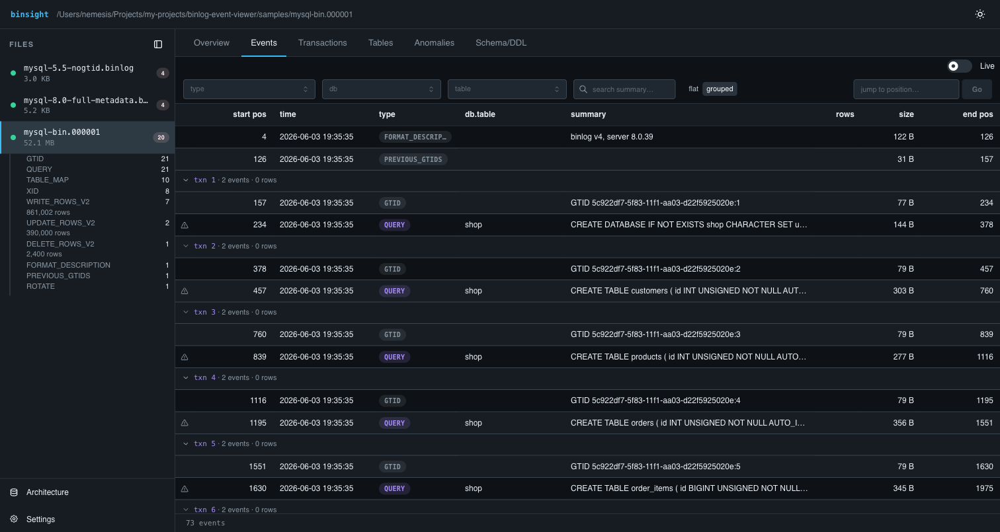
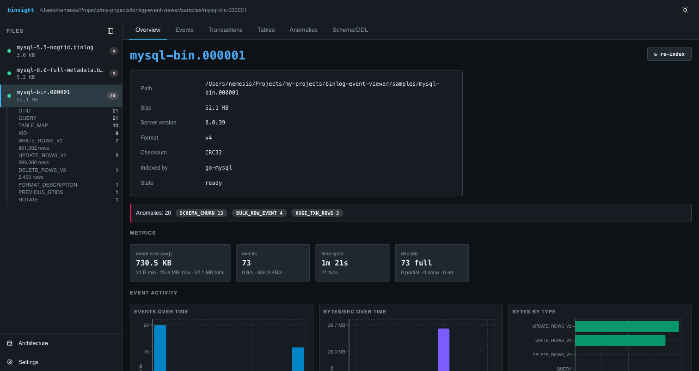
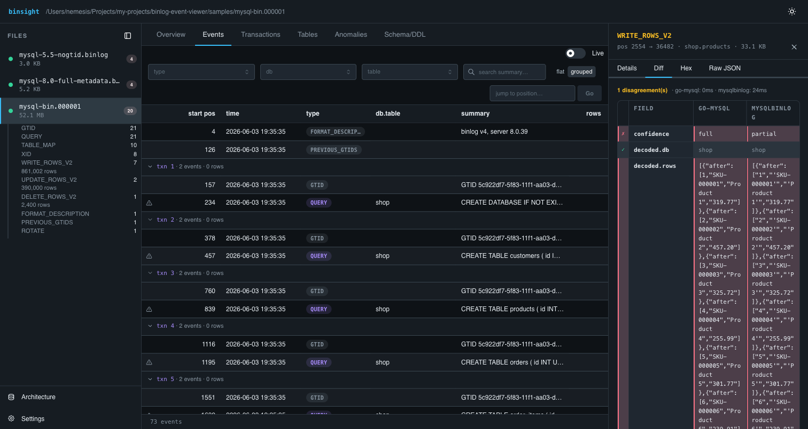

# binsight

> A local, read-only **MySQL & MariaDB binlog viewer and analyzer** for developers.

[](https://github.com/adrijshikhar/binsight/releases)
[](https://github.com/adrijshikhar/binsight/actions/workflows/ci.yml)
[](LICENSE)
[](go.mod)
[](https://ghcr.io/adrijshikhar/binsight)

---

**Quick nav:** [What it is](#what-it-is) · [Screenshots](#screenshots) · [Features](#features) · [Install](#install) · [Usage](#usage) · [Architecture](#architecture) · [License](#license)

---

## What it is

binsight is a local, read-only **MySQL & MariaDB binlog viewer, analyzer,
parser, inspector, and decoder** for developers.
Point it at a directory of binlog files and it produces a filterable event
stream, transaction grouping, row-image diffs, hex forensics, anomaly detection,
and a schema timeline — all in a browser UI backed by a zero-config SQLite
index. It also streams live from a running server as a replica, acting as a
`mysqlbinlog` replacement with a visual front-end.

Decode never blocks the UI. Everything the browser reads comes from the index.

---

## Screenshots







---

## Demo


> *Full demo GIF coming soon.*

---

## Features

| Feature | Detail |
|---|---|
| **Event stream** | Filterable, virtualised table; group by transaction; click any event to open the drawer |
| **Row images** | Before/after values for `UPDATE`, full rows for `INSERT`/`DELETE` |
| **Diff view** | Side-by-side go-mysql vs `mysqlbinlog` decode; per-field divergence highlighted |
| **Hex view** | Raw bytes with event-header overlay — for binlog forensics |
| **Overview metrics** | Per-file dashboard: event counts, sizes, TPS, top tables/operations |
| **Anomaly detection** | Six pluggable detectors: huge transaction (bytes + rows), long-running, rolled-back, bulk row event, schema churn; inline ⚠ markers; configurable thresholds in Settings |
| **Schema / DDL timeline** | All DDL statements ordered by time; cascade-risk highlights |
| **Live tail** | fsnotify watcher + SSE push; appends from the committed boundary without re-scanning |
| **Remote streaming** | Connects as a MySQL/MariaDB replica, mirrors binlog files byte-for-byte into a local spool |
| **> 4 GiB file support** | Wrap-immune position accumulator; `pos_wrap` anomaly detector; amber row markers at each 2³² boundary |
| **MySQL + MariaDB** | Tested against MySQL 5.5–8.4 and MariaDB 10.6/11.4; Docker version matrix in CI |

---

## Install

### Homebrew (macOS / Linux)

```sh
brew install adrijshikhar/tap/binsight
```

> **macOS Gatekeeper:** the binaries are not notarized, so macOS quarantines them. The cask clears this automatically on install (0.1.1+). If you install a **prebuilt binary** manually instead, Gatekeeper will kill it on first run — clear it with `xattr -dr com.apple.quarantine ./binsight`.

### Docker

```sh
docker run --rm -p 8080:8080 -v /path/to/binlogs:/data \
  ghcr.io/adrijshikhar/binsight:0.1.1 serve /data
```

### go install

```sh
go install github.com/adrijshikhar/binsight/cmd/binsight@v0.1.1
```

### Prebuilt binaries

Prebuilt binaries: see the [latest GitHub release](https://github.com/adrijshikhar/binsight/releases/latest).

---

## Usage

### Start the viewer

```sh
binsight serve /path/to/binlog/dir
```

Open <http://localhost:8080>.

### Quickstart with a sample binlog

```sh
# Download the demo binlog (from the latest release) into samples/
curl -L https://github.com/adrijshikhar/binsight/releases/latest/download/sample-binlog.tar.gz \
  | tar -xz -C samples
binsight serve samples

# Or generate a local sample (requires make + a running MySQL):
make sample
```

### Environment variables

| Variable | Default | Description |
|---|---|---|
| `BV_PORT` | `8080` | HTTP listen port |
| `BV_BIND` | `127.0.0.1` | Bind address. Loopback by default (the UI has no auth); set `0.0.0.0` to deliberately expose it. |
| `BV_DATA_DIR` | `/var/lib/binlog-viewer` | SQLite index + settings storage. On a local (non-Docker) install, set this to a writable path such as `~/.local/share/binsight`. |
| `BV_WATCH_DIR` | `/data` | Binlog directory (overrides the CLI argument when set) |
| `BV_WATCH` | `true` | Enable live file-watching (set `false` to disable) |
| `BV_MYSQLBINLOG_PATH` | `mysqlbinlog` | Path to the `mysqlbinlog` binary (optional; enables the Diff adapter) |
| `BV_STREAM_ENABLED` | `false` | Enable remote replication streaming |
| `BV_STREAM_HOST` | _(unset)_ | MySQL/MariaDB host |
| `BV_STREAM_PORT` | `3306` | MySQL/MariaDB port |
| `BV_STREAM_USER` | _(unset)_ | Replication user |
| `BV_STREAM_PASSWORD` | _(unset)_ | Replication user password |
| `BV_STREAM_FLAVOR` | `mysql` | Source flavor: `mysql` or `mariadb` |
| `BV_STREAM_SERVER_ID` | `51789` | server-id sent to source; must not collide with another replica |
| `BV_STREAM_MAX_SPOOL_BYTES` | `2147483648` | Spool cap in bytes (2 GiB); oldest files pruned when exceeded |

### Remote streaming (Phase 2)

Stream binlogs straight from a live MySQL/MariaDB server. binsight connects as
a replica and mirrors the server's binlog files into `DATA_DIR/spool/`, where
the normal index + live-tail pipeline picks them up.

Create a replication user on the source:

```sql
CREATE USER 'binsight'@'%' IDENTIFIED BY '<password>';
GRANT REPLICATION SLAVE, REPLICATION CLIENT ON *.* TO 'binsight'@'%';
```

Enable in **Settings → Remote streaming**, or via env:

```sh
BV_STREAM_ENABLED=true \
BV_STREAM_HOST=db.internal \
BV_STREAM_USER=binsight \
BV_STREAM_PASSWORD=... \
binsight serve /data
```

Resume is GTID-based when `gtid_mode=ON` (always for MariaDB), else
file+position — both at a transaction boundary, never mid-transaction.

---

## Architecture

Pluggable decoder adapters → normalized event schema → SQLite metadata index →
REST API + SSE → embedded React UI.

See [docs/pluggable-architecture.html](docs/pluggable-architecture.html) for a
full diagram and adapter capability matrix.

---

## License

[MIT](LICENSE) © Adrij Shikhar
